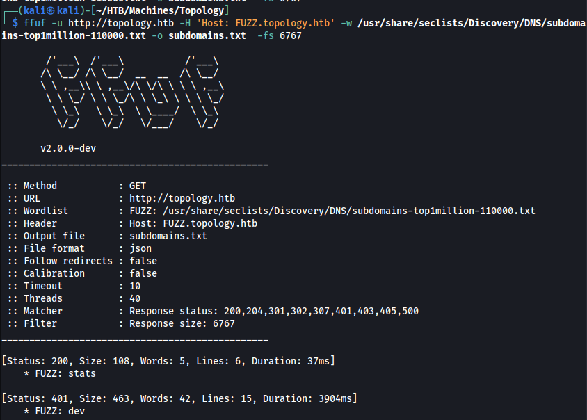
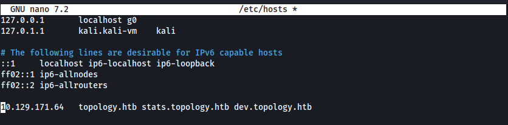
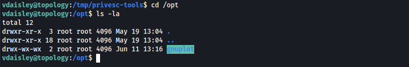

# INITIAL ACCESS

## DISCOVERY

The initial `nmap` scan revealed ports 22 and 80 open.


A subdirectory enumeration with `ffuf` revealed the subdomains `dev` and `stats`



These subdomains were then added to `/etc/passwd` to explore these web pages.



The `dev.topology.htb` website was password protected.


The `stats.topology.htb` website did not reveal any critical information.


The main website, `topology.htb` revealed potential usernames and a new subdomain: `latex.topology.htb`. This was also added to `/etc/hosts` for further exploration.


The `latex.topology.htb` contained an input field for `latex` expressions. This could be abused to attack the server and retrieve the password for the `dev` subdomain.


## EXPLOIT 1 - LATEX LFI WITH FILTER BYPASS

Any values input at the form would be sent to the web server as follows:

```http
GET /equation.php?eqn=<input> HTTP/1.1
Host: latex.topology.htb
```

A simple request was captured and sent to Burp's Repeater for further analysis and fuzzing.

The following resources allowed a better understanding of `Latex` and how it can be abused.

- https://0day.work/hacking-with-latex/
- https://en.wikibooks.org/wiki/TeX

At first, it was verified that multiple commands were blacklisted, such as `\immediate`, `\input`, and `\write`. However, the command to read one line of a given file was still allowed:

```latex
\newread\file
\openin\file=/etc/passwd
\read\file to\line
\text{\line}
\closein\file
```

Although the command above is multi-lined, in `Latex` you can simply use one line to issue multi-lined commands. Therefore the following payload was successful.

`\newread\file\openin\file=/etc/passwd\read\file%20to\line\text{\line}\closein\file`


Furthermore, it was possible to repeat the `\read\file to\line` a few times in order to read other lines of a given file.

The screenshot below shows the same command as before but with two `\read\file to\line`, so the second line of `/etc/passwd` was provided.


This, however, was limited to only a few lines. Nonetheless, the goal was to obtain the contents of a `.htpasswd` file, which has its location defined in a `.htaccess` file in the website's root directory.

Since the password-protected web page was `dev.topology.htb`, it was safe to assume that its root directory could be at `/var/www/dev/`, which was correct.

The third line of the `.htaccess` file revealed the location of the `.htpasswd` file.


However, when attempting to read the file, there was no output.


This was because the `.htpasswd` normally contains hashes in the format `username:$apr1$71850310$gh9m4xcAn3MGxogwX/ztb.`. The characters `:` and `$` are considered "bad characters" for `Latex` and throw an error, which was not reflected in this web server.

However, it was possible to escape these characters with `\detokenize`. The following command was issued to read the contents of `.htpasswd`:

`\newread\file\openin\file=/var/www/dev/.htpasswd\read\file%20to\line\closein\file\texttt{\detokenize\expandafter{\line}}`

> Note that using `texttt` instead of `text` simply changed the font format to monospaced.


Then, the hash could be cracked with `john`, which revealed the password `calculus20`


Although that password worked in the `dev` subdomain, it also worked with SSH. So that was the route followed.


# PRIVILEGE ESCALATION

## DISCOVERY

After getting initial access as **vdaisly**, the [pspy](https://github.com/DominicBreuker/pspy) binary was run to see if any scheduled task was happening in the background. After about a minute, it was discovered that the `gnuplot` binary was being called along with other commands.


An interesting finding was that the `/opt/gnuplot` directory was not readable but it was writable by everyone. This could be abused to inject malicious files into the folder.



## EXPLOIT 2 - DIRECTORY PERMISSIONS ABUSE WITH GNUPLOT TASK

The exploit used for privilege escalation relied on two issues:

1. The `/opt/gnuplot` folder was writeable by everyone.
2. The `root` user was running `/bin/sh -c find "/opt/gnuplot" -name "*.plt" -exec gnuplot {} \;` every minute.

The `find` command was being used to find **all files** with the **.plt** extension in the `/opt/gnuplot` directory and its subdirectories and then **execute** the `gnuplot` command on each of those files.

To demonstrate, a file named `evil.plt` was created in a controlled directory. The content of `evil.plt` was `` `id` ``. Which was successfully executed by `gnuplot` as shown below.


So the following command was used to inject a malicious `.plt` file in the `/opt/gnuplot` directory, which would add the *suid* bit to `/bin/bash`.

``echo -e '`chmod +s /bin/bash`' > /opt/gnuplot/evil.plt ``

Then a root shell was obtained with

`/bin/bash -p`


